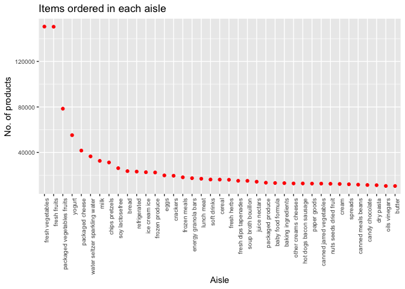

p8105\_hw3\_2000
================
Uma Palaniappan, unp2000

# Problem 1

## Instacart

``` r
library(tidyverse)
```

    ## ── Attaching packages ────────────────────────────────────────────────────────────── tidyverse 1.2.1 ──

    ## ✔ ggplot2 3.2.1     ✔ purrr   0.3.2
    ## ✔ tibble  2.1.3     ✔ dplyr   0.8.3
    ## ✔ tidyr   1.0.0     ✔ stringr 1.4.0
    ## ✔ readr   1.3.1     ✔ forcats 0.4.0

    ## ── Conflicts ───────────────────────────────────────────────────────────────── tidyverse_conflicts() ──
    ## ✖ dplyr::filter() masks stats::filter()
    ## ✖ dplyr::lag()    masks stats::lag()

``` r
library(p8105.datasets)
data("instacart") 
```

1384617 1384617 rows 15 15 columns

How many aisles are there and which aisles are the most items ordered
from? There are 134 distinct aisles.

39123

``` r
instacart_new=instacart %>%
    group_by(aisle_id, aisle) %>%
    summarize (n = n()) %>%
    arrange(desc(n))
```

The aisles that the most items are ordered from are fresh vegetables
(aisle 83, n = 150,609), fresh fruits (aisle 24, n = 150,473), and
packaged vegetable and fruits (aisle 123, n = 78,493).

Make a plot that shows the number of items ordered in each aisle,
limiting this to aisles with more than 10000 items ordered. Arrange
aisles sensibly, and organize your plot so others can read it.

``` r
plot_1= filter(instacart_new, n > 10000)
ggplot(
  plot_1, 
  aes(x = reorder(aisle, -n), y = n)) + 
  geom_point(color = 'red') +
  theme(axis.text.x = element_text(angle = 90, hjust = 1),
        axis.text = element_text(size = 7.5)) +
  labs(
    title = "Items ordered in each aisle",
    x = "Aisle",
    y = "No. of products"
  )
```

<!-- -->

Make a table showing the three most popular items in each of the aisles
“baking ingredients”, “dog food care”, and “packaged vegetables
fruits”. Include the number of times each item is ordered in your
table.

``` r
insta_pop = filter(instacart, aisle == "baking ingredients", aisle == "dog food care", aisle == "packaged vegetables fruits") %>%
      group_by(aisle, product_name) %>%
      summarize (n = n()) %>%
      arrange(desc(n)) %>%
      knitr::kable()
```
