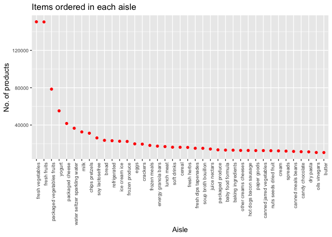
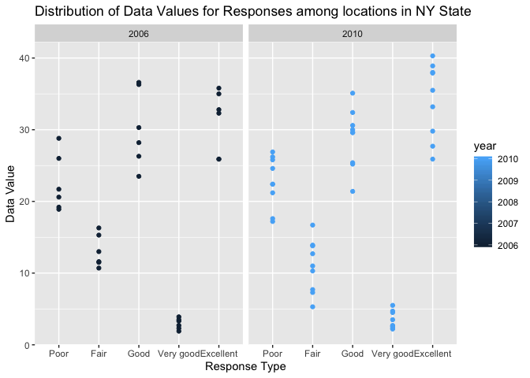
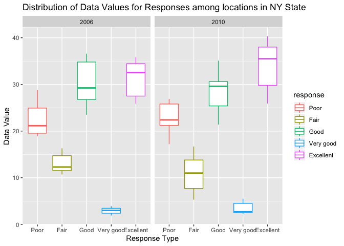
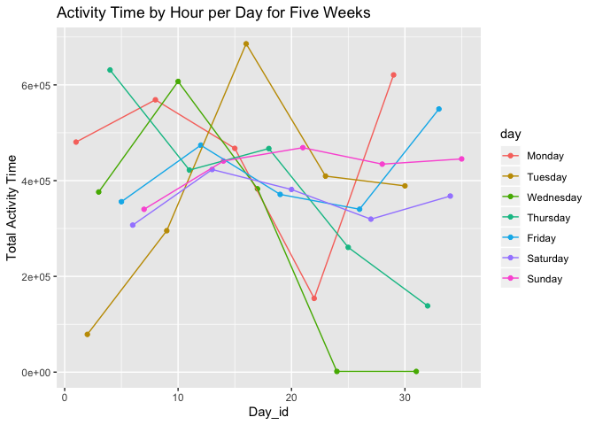

p8105\_hw3\_2000
================
Uma Palaniappan, unp2000

# Problem 1

## Instacart

``` r
library(tidyverse)
```

    ## ── Attaching packages ───────────────────────────────────────────────────────────────────────────────────── tidyverse 1.2.1 ──

    ## ✔ ggplot2 3.2.1     ✔ purrr   0.3.2
    ## ✔ tibble  2.1.3     ✔ dplyr   0.8.3
    ## ✔ tidyr   1.0.0     ✔ stringr 1.4.0
    ## ✔ readr   1.3.1     ✔ forcats 0.4.0

    ## ── Conflicts ──────────────────────────────────────────────────────────────────────────────────────── tidyverse_conflicts() ──
    ## ✖ dplyr::filter() masks stats::filter()
    ## ✖ dplyr::lag()    masks stats::lag()

``` r
library(p8105.datasets)
data("instacart") 
```

The instacart data is based on Instacart which is an online grocery
service that allows you to shop online from local stores. This specific
dataset contains with 1384617 1384617 observations of 131,209 unique
users and 15 15 columns.There are 15 variables that include the
order\_id, the product\_id, information about the day the order was
placed, the hour the order was plaeced, the name of the product ordered
and the specific aisle the product was ordered on. Some key variables
include the aisle\_id and the aisle which are important in identifying
the specific aisle the corresponding product was ordered on. From the
code below we can see that there are 21 distinct departments.

``` r
instacart %>%
    distinct(department)
```

    ## # A tibble: 21 x 1
    ##    department  
    ##    <chr>       
    ##  1 dairy eggs  
    ##  2 produce     
    ##  3 canned goods
    ##  4 beverages   
    ##  5 deli        
    ##  6 snacks      
    ##  7 pantry      
    ##  8 frozen      
    ##  9 meat seafood
    ## 10 household   
    ## # … with 11 more rows

How many aisles are there and which aisles are the most items ordered
from? There are 134 distinct aisles.

``` r
instacart_new=instacart %>%
    janitor::clean_names() %>%
    group_by(aisle_id, aisle) %>%
    summarize (n = n()) %>%
    arrange(desc(n))
```

The aisles that the most items are ordered from are fresh vegetables
(aisle 83, n = 150,609), fresh fruits (aisle 24, n = 150,473), and
packaged vegetable and fruits (aisle 123, n = 78,493).

Make a plot that shows the number of items ordered in each aisle,
limiting this to aisles with more than 10000 items ordered. Arrange
aisles sensibly, and organize your plot so others can read it.

``` r
plot_1= filter(instacart_new, n > 10000)
ggplot(
  plot_1, 
  aes(x = reorder(aisle, -n), y = n)) + 
  geom_point(color = 'red') +
  theme(axis.text.x = element_text(angle = 90, hjust = 1),
        axis.text = element_text(size = 7.5)) +
  labs(
    title = "Items ordered in each aisle",
    x = "Aisle",
    y = "No. of products"
  )
```

<!-- -->

Make a table showing the three most popular items in each of the aisles
“baking ingredients”, “dog food care”, and “packaged vegetables
fruits”. Include the number of times each item is ordered in your
table.

``` r
library(knitr)
insta_rank_new = instacart %>%
      janitor::clean_names() %>%
      filter(aisle == "baking ingredients"| aisle == "dog food care"| aisle == 
      "packaged vegetables fruits") %>%
      group_by(aisle, product_name) %>%
      summarise(n = n()) %>%
      mutate(product_ranking = min_rank(desc(n))) %>% 
      filter(product_ranking < 4)  %>%
      knitr::kable ()
```

Make a table showing the mean hour of the day at which Pink Lady Apples
and Coffee Ice Cream are ordered on each day of the week; format this
table for human readers (i.e. produce a 2 x 7 table).

``` r
instacart_table2=instacart %>%
  filter(product_name == "Pink Lady Apples" | 
    product_name == "Coffee Ice Cream") %>%
    group_by(product_name, order_dow) %>%
    summarize(mean_order_hour= mean(order_hour_of_day)) %>%
    select(product_name, order_dow, mean_order_hour) %>%
    pivot_wider(
      names_from = order_dow,
        values_from = mean_order_hour) %>%
    knitr::kable ()
```

# Problem 2

First, do some data cleaning:

format the data to use appropriate variable names; focus on the “Overall
Health” topic include only responses from “Excellent” to “Poor” organize
responses as a factor taking levels ordered from “Poor” to “Excellent”

``` r
library(p8105.datasets)
data("brfss_smart2010")
```

``` r
brfss_new=brfss_smart2010 %>%
    janitor::clean_names() %>%
    filter(topic == "Overall Health"|
           response == "Excellent"|
           response == "Very good"|
           response == "Good" |
           response == "Fair"|
           response == "Poor") %>%
   mutate(response = 
            factor(response, labels = c("Poor", "Fair", "Good", "Very good", "Excellent")))%>%
            select(-location_id, -data_value_footnote_symbol, - data_value_footnote)
```

In 2002, which states were observed at 7 or more locations? What about
in 2010?

``` r
brfss_new %>%
  filter(year == "2002") %>%
  group_by(locationabbr) %>%
  summarize(
    number_locations = n_distinct(geo_location)) %>%
    filter(number_locations>6) %>%
    arrange(desc(number_locations))
```

    ## # A tibble: 6 x 2
    ##   locationabbr number_locations
    ##   <chr>                   <int>
    ## 1 PA                         10
    ## 2 MA                          8
    ## 3 NJ                          8
    ## 4 CT                          7
    ## 5 FL                          7
    ## 6 NC                          7

In 2002, the states that were observed at 7 or more locations were NC,
FL, CT, NJ, MA, PA.

In 2010, the states that were observed at 7 or more locations were SC,
PA, CO, OH, NY, MA, WA, NE, NC, MD, CA, TX, NJ, FL

``` r
brfss_new %>%
  filter(year == "2010") %>%
  group_by(locationabbr) %>%
  summarize(
    number_locations = n_distinct(geo_location)) %>%
    filter(number_locations>6) %>%
    arrange(desc(number_locations))
```

    ## # A tibble: 14 x 2
    ##    locationabbr number_locations
    ##    <chr>                   <int>
    ##  1 FL                         41
    ##  2 NJ                         19
    ##  3 TX                         16
    ##  4 CA                         12
    ##  5 MD                         12
    ##  6 NC                         12
    ##  7 NE                         10
    ##  8 WA                         10
    ##  9 MA                          9
    ## 10 NY                          9
    ## 11 OH                          8
    ## 12 CO                          7
    ## 13 PA                          7
    ## 14 SC                          7

In 2010, the states that were observed at 7 or more locations were SC,
PA, CO, OH, NY, MA, WA, NE, NC, MD, CA, TX, NJ, FL

Construct a dataset that is limited to Excellent responses, and
contains, year, state, and a variable that averages the data\_value
across locations within a state. Make a “spaghetti” plot of this average
value over time within a state (that is, make a plot showing a line for
each state across years – the geom\_line geometry and group aesthetic
will help).

``` r
excellent_data = brfss_new %>%
  filter(response == "Excellent") %>%
  group_by(year, locationabbr, response) %>%
  summarise(mean_data = mean(data_value, na.rm = TRUE)) 

brfss_spaghetti =
  excellent_data %>%
  ggplot(aes(x = year, y = mean_data, group = locationabbr)) +
  geom_line(aes(color = locationabbr)) +
  labs(
    title = "Average value over time within 50 states",
    x = "Year",
    y = "Average Data Value"
  )
brfss_spaghetti
```

<!-- -->
Make a two-panel plot showing, for the years 2006, and 2010,
distribution of data\_value for responses (“Poor” to “Excellent”) among
locations in NY State.

``` r
two_panel = brfss_new %>%
  filter(topic == "Overall Health"|
           response == "Excellent"|
           response == "Very good"|
           response == "Good" |
           response == "Fair"|
           response == "Poor",
           year == "2006"|
           year == "2010",
           locationabbr == "NY") 


ggplot(two_panel, aes(x = response, y = data_value, color = response)) + 
  geom_boxplot() +
  facet_grid(. ~year) +
  labs(
    title = "Distribution of Data Values for Responses among locations in NY State",
    x = "Response Type",
    y = "Data Value"
  )
```

<!-- -->

# Problem 3

``` r
problem3_data = 
  read_csv("./data/accel_data.csv") %>%
  janitor::clean_names() %>%
  mutate(day = factor(day, labels = c("Monday", "Tuesday", "Wednesday", "Thursday", "Friday", "Saturday", "Sunday")),
         dow = day == "Saturday" | day == "Sunday",
         dow = ifelse(dow == TRUE, "Weekend", "Weekday")) %>%
  select(week, day_id, day, dow, everything ()) 
```

    ## Parsed with column specification:
    ## cols(
    ##   .default = col_double(),
    ##   day = col_character()
    ## )

    ## See spec(...) for full column specifications.

We have 35 obeservations and 1444 variables in the problem 3 dataset
which uses five weeks of accelerometer data that was collected on a 63
year-old male with BMI 25. Additionally, we have 35 rows and 1444
columns. The variables are the week in which the data was collected, the
specific day (Monday - Sunday), the day of the week (either Weekday or
Weekend), and the activity per minute for 24 hours (activity\_1 to
activity\_1440)

Traditional analyses of accelerometer data focus on the total activity
over the day. Using your tidied dataset, aggregate accross minutes to
create a total activity variable for each day, and create a table
showing these totals. Are any trends apparent?

``` r
acce_table = problem3_data %>%
  pivot_longer(activity_1:activity_1440, 
              names_to = "activity_minute",
              values_to = "activity") %>%
  group_by(day_id, day, week, dow) %>%
  summarize(daily_act= sum(activity))

acce_table
```

    ## # A tibble: 35 x 5
    ## # Groups:   day_id, day, week [35]
    ##    day_id day        week dow     daily_act
    ##     <dbl> <fct>     <dbl> <chr>       <dbl>
    ##  1      1 Monday        1 Weekday   480543.
    ##  2      2 Tuesday       1 Weekday    78828.
    ##  3      3 Wednesday     1 Weekday   376254 
    ##  4      4 Thursday      1 Weekday   631105 
    ##  5      5 Friday        1 Weekday   355924.
    ##  6      6 Saturday      1 Weekend   307094.
    ##  7      7 Sunday        1 Weekend   340115.
    ##  8      8 Monday        2 Weekday   568839 
    ##  9      9 Tuesday       2 Weekday   295431 
    ## 10     10 Wednesday     2 Weekday   607175 
    ## # … with 25 more rows

When looking at daily activity by Weeks we can see that overall there is
some increase and some decrease with the activity time. Therefore, it is
a bit difficult to analyze whether there is a linear increase from Week
1 to Week 5, in fact we can say that it looks mostly non-linear. Some of
the lowest daily activity throughout the 5 week period was on Wednesdays
in Week 4 and Week 5 while some of the highest daily activity throughout
the 5 week period was on Thursdays of Week 1 and Week 3. Most of the
Weeks had activity that fluctuated and some started off higher than
other weeks.

Accelerometer data allows the inspection activity over the course of the
day. Make a single-panel plot that shows the 24-hour activity time
courses for each day and use color to indicate day of the week. Describe
in words any patterns or conclusions you can make based on this graph.

``` r
plot_accel= acce_table %>%
  ggplot(aes(x = day_id, y = daily_act, color = day)) +
  geom_point() +
  geom_line() +
  labs(
      title = "Activity Time by Hour per Day for Five Weeks",
      x = "Day_id",
      y = "Total Activity Time"
      )
plot_accel
```

<!-- -->
Based on this graph we can see that for the Weekdays (Monday - Friday)
we can see that the total activity time is non-linear for the most part.
Some days start off with higher activity at the beginning of the 5 week
period (ex: Thursday) versus others start off with lower activity at the
beginning of the 5 week period (ex: Tuesday, Wednesday). Additionally,
we can see that for the most part at the end of the 5 week period the
ending total activity time is relatively similar to where activity time
started at the beginning of the 5 week period. A majority of the
variability is in the middle of the 5 week period (likely around week 3)
which is where we see the drastic increases and decreases.
